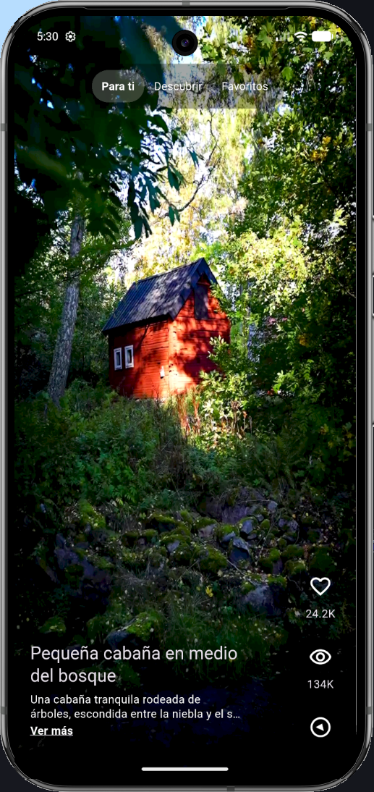
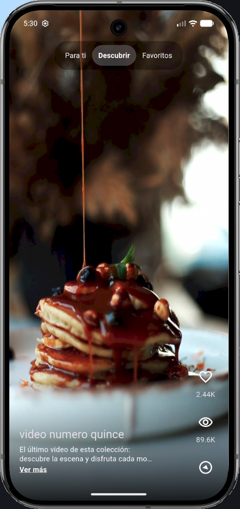
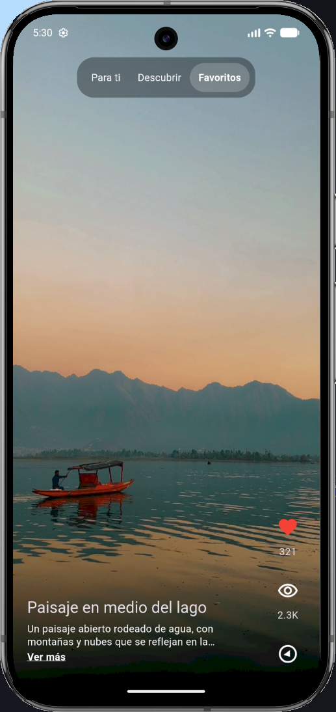
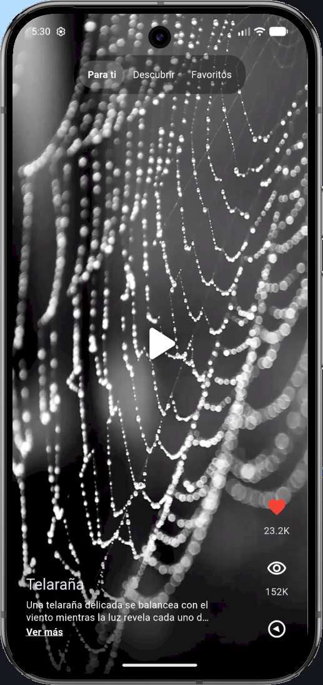
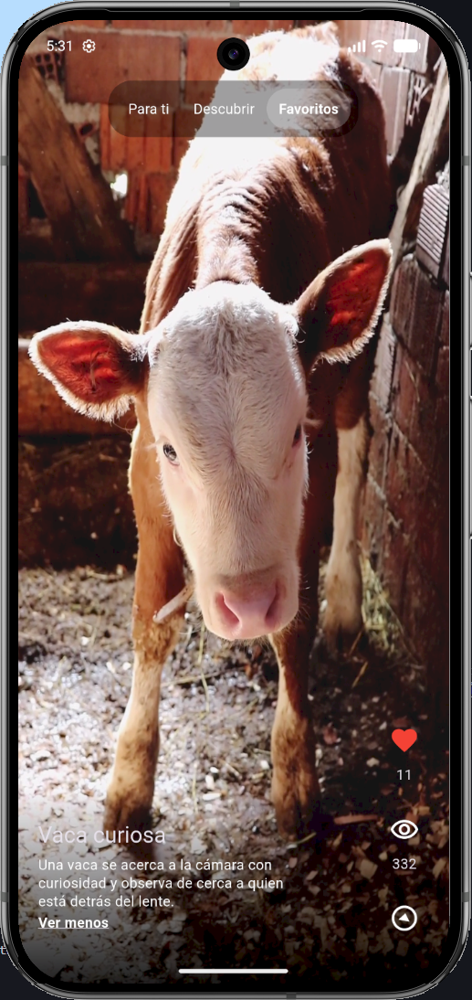
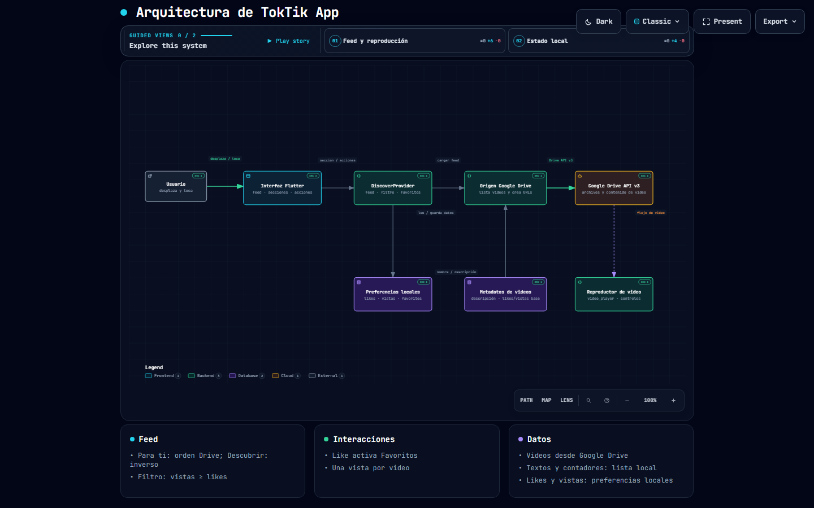

# TokTik

Aplicación móvil de videos verticales desarrollada con Flutter. Los videos se cargan desde una carpeta de Google Drive y se presentan en un feed con interacciones y estadísticas locales.

## Funcionalidades

- **Para ti:** feed vertical en el orden de la lista de Drive.
- **Descubrir:** los mismos videos en orden inverso.
- **Favoritos:** videos a los que se les ha dado like.
- **Reproducción:** toca el video para pausar o reanudar. El icono de reproducción permanece mientras está pausado y el de pausa aparece brevemente al reanudar.
- **Likes y vistas:** el botón de like alterna entre agregar y quitar un like. Cada video suma una vista una sola vez por instalación.
- **Descripciones:** se muestran debajo del nombre; las descripciones largas se pueden expandir con **Ver más**.
- **Filtro del feed:** se omiten los videos cuyo número de vistas es menor que el de likes.
- **Persistencia local:** likes, vistas y favoritos se conservan al cerrar y volver a abrir la aplicación.
- **Splash nativa de Android:** fondo negro con el icono de la aplicación.

## Requisitos

- Flutter instalado y configurado.
- Acceso a internet.
- Un proyecto de Google Cloud con Google Drive API habilitada.
- Una API key y el ID de una carpeta de Drive con videos accesibles para lectura.

## Configuración de Google Drive

1. Habilita **Google Drive API** en Google Cloud y crea una API key.
2. Comparte la carpeta de Drive y sus videos con permiso de lectura para que la aplicación pueda acceder a ellos.
3. Obtén el ID desde la URL de la carpeta: `https://drive.google.com/drive/folders/ID_DE_CARPETA`.
4. Edita `toktik_app/lib/config/google_drive_config.dart` y asigna los valores de `folderId` y `apiKey`.
5. En `toktik_app/`, ejecuta:

   ```sh
   flutter pub get
   flutter run
   ```

La app muestra archivos de video contenidos directamente en la carpeta. Los nombres numéricos como `1.mp4`, `2.mp4` se asocian con los metadatos de `toktik_app/lib/shared/data/local_video_posts.dart`, incluyendo nombre, descripción, likes y vistas iniciales. Los archivos que no tengan metadatos usan su nombre de archivo y una descripción genérica.

## Almacenamiento local

La app usa `shared_preferences`; las estadísticas se agrupan bajo la clave `video_stats_v1` y cada registro se identifica por el ID de Drive del video. En Android se puede consultar el archivo desde Android Studio **Device Explorer** en:

```text
/data/data/com.example.toktik_app/shared_prefs/FlutterSharedPreferences.xml
```

En una instalación de depuración también puede leerse con:

```sh
adb shell run-as com.example.toktik_app cat shared_prefs/FlutterSharedPreferences.xml
```

## Estructura principal

- `toktik_app/lib/presentation/`: pantalla, feed y controles de reproducción.
- `toktik_app/lib/domain/`: entidad de video.
- `toktik_app/lib/infrastructure/`: consulta de Drive y persistencia local.
- `toktik_app/lib/shared/data/local_video_posts.dart`: metadatos locales asociados a los nombres de archivo.
- `toktik_app/assets/icon.png`: icono usado por la splash nativa de Android.

---

## Evidencias

||||
|---|---|---|

<br>

|||
|---|---|
|Video en pausa|Descripción extendida|

---

## Diagrama de arquitectura

**Arquitectura del proyecto:** [Diagrama de la arquitectura del proyecto](https://diegomiguel04.github.io/Practicas_DMI_230260/Practica04/arquitectura/)

